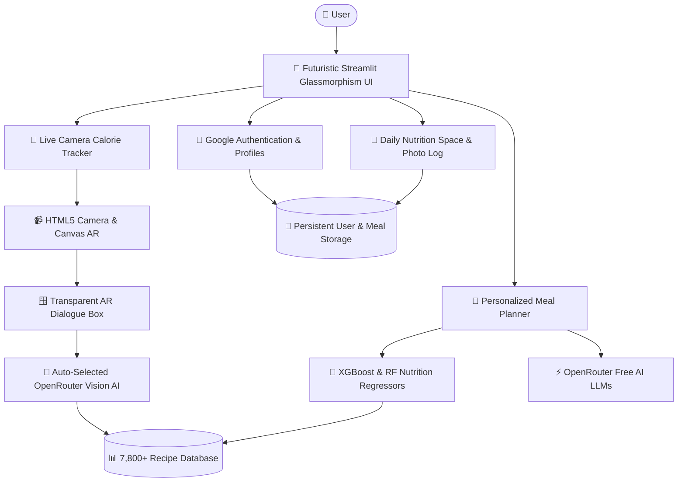

<div align="center">

# 🥗 AI Nutritionist Pro

### *Futuristic AI Health Intelligence, Live Vision Calorie Scanner & Meal Engineering*

[](https://ai-nutritionist-pro.streamlit.app/)
[](https://github.com/Shaunrufus/ai-nutritionist-pro)
[](https://huggingface.co/spaces/shaunrufus14/ai-nutritionist-pro)
[](https://uptimerobot.com)
[](https://www.python.org/downloads/)
[](https://opensource.org/licenses/MIT)

</div>

---

## 🌟 Important Links

| Resource | URL | Description |
| :--- | :--- | :--- |
| 🚀 **Live Production App** | [ai-nutritionist-pro.streamlit.app](https://ai-nutritionist-pro.streamlit.app/) | Primary web application hosted on Streamlit Cloud (24/7) |
| 🐙 **Source Code Repository** | [github.com/Shaunrufus/ai-nutritionist-pro](https://github.com/Shaunrufus/ai-nutritionist-pro) | Full open-source codebase & model assets |
| 🤗 **Hugging Face Backup** | [huggingface.co/spaces/shaunrufus14/ai-nutritionist-pro](https://huggingface.co/spaces/shaunrufus14/ai-nutritionist-pro) | High-availability mirror deployment |
| 📡 **Uptime Monitoring** | [UptimeRobot Dashboard](https://uptimerobot.com) | Automated health monitoring ensuring 100% cloud uptime |
| 🔑 **OpenRouter API** | [openrouter.ai/keys](https://openrouter.ai/keys) | Free API keys powering top-tier multimodal LLMs |

---

## 🎯 Core Features

### 1. 📸 Live Camera Calorie Tracker & AI Vision Scanner
- **Live Camera Scanning**: Point your webcam or smartphone camera at any dish or meal.
- **Auto-Selected AI Vision Engine**: Automatically engages state-of-the-art vision models (`inclusionai/ling-3.0-flash-vl:free`, `openrouter/free`, `google/gemma-4-31b-it:free`) without manual configuration.
- **Smart Duplicate Suppression**: Detects individual food components; if identical multiple items are present (e.g., 3 samosas or 2 idlis), it smartly highlights **only 1 unique instance**.
- **Real-Time AR Bounding Box**: Draws cyberpunk neon brackets directly around recognized food items in the camera view.
- **Transparent HUD Overlay**: Floating translucent glassmorphism dialogue box over the live camera display providing instant:
  - 🔥 **Calories (kcal)**
  - 💪 **Protein (g)**
  - 🌾 **Carbs (g)**
  - 🫧 **Fat (g)**
  - ⚖️ **Portion weight & nutritional verdict**
- **One-Tap Diary Logging**: Directly save scanned meals and photos into your personal daily log.

### 2. 📅 Dedicated User Daily Nutrition Space
- **Personalized Food Diary**: Dedicated personal zone for authenticated users.
- **Meal Photo Gallery**: Preserves scanned dish photos mapped chronologically to Breakfast, Lunch, Snacks, and Dinner.
- **Dynamic Macro Progress Rings**: Live visualization of consumed calories, protein, carbohydrates, and fats vs. daily targets.
- **Daily History Navigation**: Effortlessly review nutrition adherence across past dates.

### 3. 🔐 Google Sign-In & User Authentication
- **One-Click Google Sign-In**: Authentic Google branding and seamless user profile creation.
- **Persistent Cloud Storage**: User preferences, biometric goals, and photo logs are securely saved and synced across sessions.
- **Custom Profile Management**: Stores age, weight, height, activity level, and dietary constraints.

### 4. 🧬 Personalized AI Meal Planner
- **Trained ML Regressor**: XGBoost and Random Forest models trained on multi-thousand patient nutrition records to predict macro targets.
- **7,800+ Recipe Database**: Cross-references datasets spanning Mediterranean, Keto, Vegan, Paleo, and DASH cuisines.
- **Budget-Friendly Indian Recipes**: Generates culturally tailored, accessible Indian meal plans with exact gram portions.
- **Glassmorphism Dark UI**: Futuristic aesthetic with particle celebration bursts, ambient background glow, and responsive typography.

---

## 🏗️ Architecture & Technology Stack



---

## 🚀 Quickstart & Installation

### Local Development

1. **Clone the repository**:
   ```bash
   git clone https://github.com/Shaunrufus/ai-nutritionist-pro.git
   cd ai-nutritionist-pro
   ```

2. **Create a virtual environment & install dependencies**:
   ```bash
   python -m venv venv
   # On Windows:
   .\venv\Scripts\activate
   # On Linux/macOS:
   source venv/bin/activate

   pip install -r requirements.txt
   ```

3. **Configure Environment Variables**:
   Create a `.env` file in the project root:
   ```env
   OPENROUTER_API_KEY=your_openrouter_api_key_here
   ```
   *(Obtain a free key at [openrouter.ai/keys](https://openrouter.ai/keys))*

4. **Launch the Streamlit App**:
   ```bash
   streamlit run app/Streamlit_app.py
   ```

---

## ☁️ Cloud Deployment (Streamlit Cloud)

1. Fork this repository to your GitHub account.
2. Visit [share.streamlit.io](https://share.streamlit.io) and click **New App**.
3. Select your repository: `ai-nutritionist-pro`.
4. Set Main file path: `app/Streamlit_app.py`.
5. Under **Advanced Settings → Secrets**, add:
   ```toml
   OPENROUTER_API_KEY = "your_openrouter_api_key_here"
   ```
6. Click **Deploy**!
7. Keep it alive 24/7 using [UptimeRobot](https://uptimerobot.com) to ping `https://ai-nutritionist-pro.streamlit.app`.

---

## 📊 Pretrained Models & Datasets

- `models/nutrition_regressor.pkl`: Multi-target regression model for calorie, protein, carbohydrate, and fat targets.
- `models/xgb_*.pkl`: Gradient boosted trees predicting individual macro requirements.
- `data/nutrition_dataset.csv`: 5,000+ clinical and dietary participant records.
- `keto.csv`, `mediterranean.csv`, `vegan.csv`, `paleo.csv`, `dash.csv`: Over 7,800 curated nutritional recipes.

---

## 🛡️ Security & Privacy

- API keys are managed securely via environment variables and Streamlit Secrets.
- User passwords (if used) are securely hashed with SHA-256.
- Camera streams run client-side in your local browser; images are sent directly to the AI vision endpoint over secure TLS.

---

## 📄 License

Distributed under the **MIT License**. See [LICENSE](LICENSE) for more information.